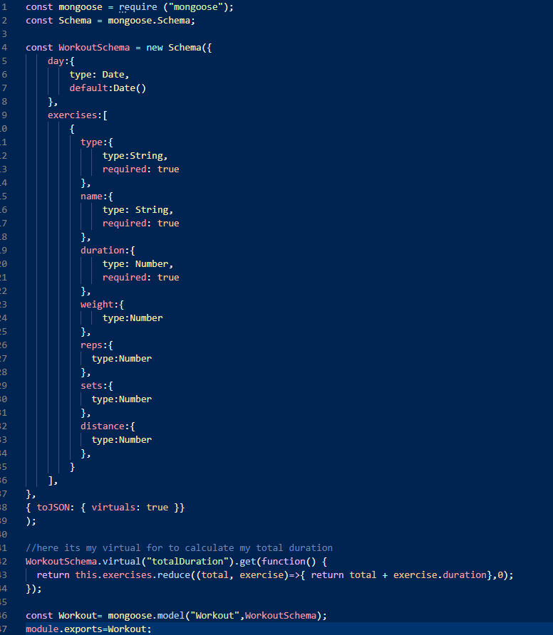
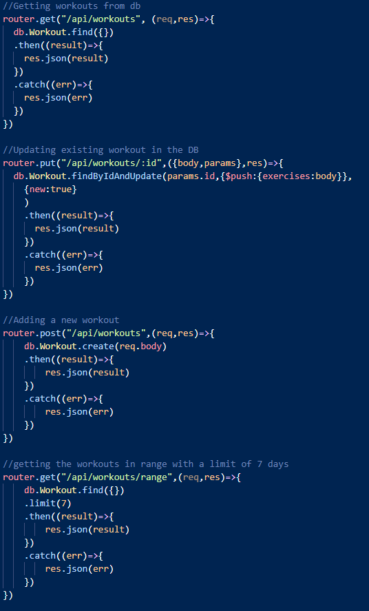
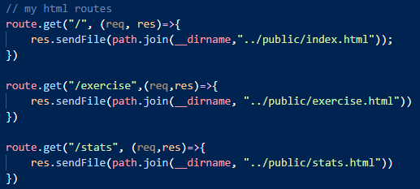

# All Fitness tracker 
WebApp for tracking workouts and monitor your progress either at the Gym or Home-workouts

- link for application deployment  <https://fitness-rd.herokuapp.com>

    
MIT 

## About this application:
`Node.js`, `Mongodb`, `mongoose`, `Express` application, handling api and html routes 

## Table of contents:
* [All Fitness tracker](#All-Fitness-tracker)
* [About](#about-this-application)
* [Usage](#usage)
* [Installation](#installation)
* [License](#license)
* [Testing](#special-testing-instructions)
* [In case of Questions](#in-case-of-questions)
* [Link to video](#link-to-video)

# Usage:
    This  application can be used locally or remotely using `HEROKU`.

    Mongodb seeds are  provided with its seeds file to facilitate set-up and help the user to pre-populate the tables for an adequate rendering.

    Right after starting the application (locally thru "node Server.JS) the page is deployed and presented to the user a summary of the past workout and options to see the `Dashboard`.

    The user can choose to continue with where he left off of his workout or create a new one from scratch. 

- Here it is an example on how this application works:

---
## Installation:
### For Local Deployment: 
The application requires `mongoose`, `Express`, `dotenv` and `morgan` node packages.
a JSON file is provided with these dependencies please Run `npm install`  before executing `node Server.js`

IMPORTANT: Please create a dontenv for your MONGODB_URI and call the link to your Atlas database service connection with your username and password  password.

### For Remote Deployment: 
Please "click" on this link to go to the heroku version of this app:

<https://fitness-rd.herokuapp.com>

## License
I have used the MIT license for this application see repository documentation.

<https://opensource.org/licenses/MIT>

## Testing
This can be manually tested or using any test tool

## Code Screenshots:
- Mongoose schema and calculation for total duration 
 
- Api and HTML routes:

  

## In case of questions:
Please contact me at my e-mail: 
rodolfodzr@gmail.com

Follow me on Github
<https://github.com/Rodolfod1>